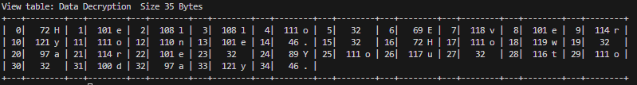

# CipherText
Simple Secure critical information.

---
## Example
### 1. Declare class CipherText as cipher 
```
    CipherText cipher();  
```
### 2. Insert Original data.
```
    char data[1023];   // my buffer data   
    size_t len;        // len data

    /* data is Hello Everyone. How are You to day. */
    len = sprintf(&data[0],"Hello Everyone. How are You to day.");
```
### 3. When see in charector and ascii dec style.
```
    char data[1023];   // my buffer data   
    size_t len;        // len data

    /* data is Hello Everyone. How are You to day. */
    len = sprintf(&data[0],"Hello Everyone. How are You to day.");
    
    /* display data */
    cipher.view_table("MY DATA",(uint8_t*)&data[0],len,10);
```


### 4. Make encrypt data and fill magic number range 0-255.<br>
### Note* magic number is help protect data same before parttern as encrpyt.     
```
   uint8_t magic_number = 234
   cipher.encrypt((uint8_t*)&data[0],len,magic_number);
```
### 5. Check data again.<br>
### Note* send this data on any communication.
```
   cipher.view_table("MY DATA",(uint8_t*)&data[0],len,10);
```
#### Data is change by CipherText and size is same original data<br><br>


### 6. Decrypt data by insert missing magic number is 123.
```
  cipher.decrpyt((uint8_t*)&data[0],len,123);
  cipher.view_table("Data Decryption",(uint8_t*)&data[0],len,10);
```
#### Data will missing by magic number wrong<br><br>


### 7. Decrypt data by insert magic number is 234.
```
  cipher.decrpyt((uint8_t*)&data[0],len,234);
  cipher.view_table("Data Decryption",(uint8_t*)&data[0],len,10);
```
#### Data is correct "Hello Everyone. How are You to day."<br><br>
